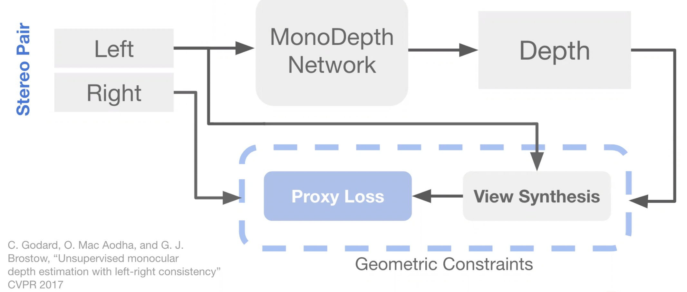
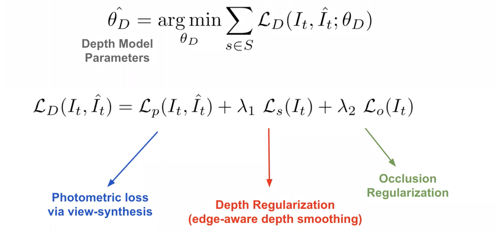
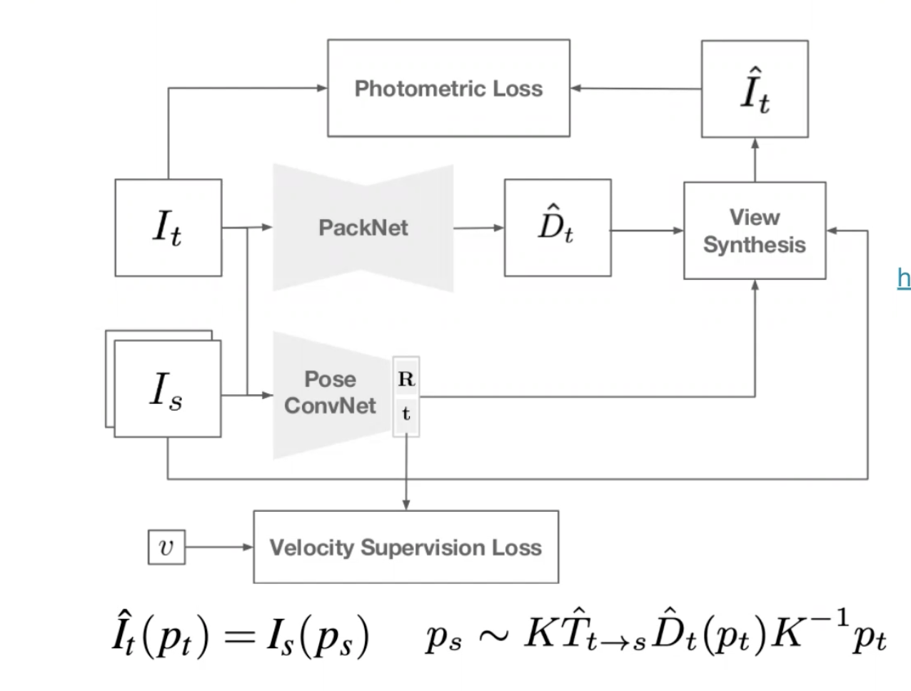

---
author:
- Ray Gifford
date: December 2021
title: "Lecture 17: Self-Supervised 3D Vision"
---

# Introduction

In this class so far, we have discussed geometric image formation, and
epipolar geometry in determining 3D points in stereo scenes, primarily
within the context of pinhole camera models. We have also
discussed the foundations of machine learning, including discussion of
back-propagation, to help us find ideal weights for a neural network. It
is often the case that camera's and various environmental factors
deviate from the pinhole camera model. Additionally, expensive sensors,
including LIDAR, or multi-view camera setups, may not be accessible for
depth estimation. We already have, at our disposal, large
amounts of data, collected from simple monocular setups. 
Monocular depth estimation has empirically been shown to serve as a
bottleneck, for 3D detection. In this lecture we build on these 
concepts, to introduce a method of estimating depth using a single
camera, that uses self-supervision to derive an objective function from
raw data.

# 3D Self-Supervision

Conceptually, what we want to do to achieve a 3D self-supervised vision,
is we want to leverage our geometric prior knowledge, discussed in
previous lectures, to derive our objective function that guides learning
for our depth network, and back-propagate loss to adjust depth network
weights. Further, in the end, we want to apply this depth network to
monocular setups.

## Self-Supervised Stereo Training

To begin, we start with a stereo case. Here we have previously thought
of using epipolar geometry to determine pixel correspondence, then
triangulate to calculate 3D points. Here instead, we want to build
something that might be applicable to monocular setups. We want to find
pixel correspondence between two viewpoints, via depth re-projection. We
know the depth from the ray along the pixel, we know the depth of the 3D
point. We \"deproject\" then re-project this depth to the other image,
and find a pixel with matched depth.

::: center

:::

**Figure 1: Self-supervised stereo training flow diagram**\
These two pixels should be corresponding to the same 3D point, from
different viewpoints, and as such are expected to have the same pixel
color values. We create an objective function from this re-projection
and attempt to re-synthesize the \"left\" image from the \"right\"
image, as seen in Figure 1, by copying over corresponding pixels
one-by-one, a process called *view synthesis*. Because we trust that our
geometry is correct (at least for cases where our system best fits a
pinhole camera model), our loss must represent error in our depth
network weights. Our loss, in this case, is calculated from the difference
in pixel color values (*photometric loss*). We then back-propagate this
loss to correct depth network weights.

::: center

:::

**Figure 2: Depth model loss calculation**\
In addition to photometric loss, depth regularization factor and
occlusion regularization factor are included, to compute loss. This
encourages the model to be consistent with expected sudden depth changes
at object discontinuity, and to have a depth map consistent with
expected visual occlusions, respectively.

## Effects of Resolution

When considering the applicability of such a self-supervised depth
estimation, to both multi-view and single camera setups, it brings up a
question of the generalizability, to different camera types, of various
resolutions. To conceptualize the effect of increasing resolution on
this depth model, we can think of probability of calculating non-zero
loss at a pixel of interest. With increased resolution, it may be
expected that the opportunity for a non-zero color difference per pixel
will also increase; as pixel grids will be differentiated into more
individual small blocks, rather than be averaged into larger
homogeneous color blocks. This allows more opportunites for depth weight
adjustments, via back-propagation. Empirically, it has been found to be the case
that in fact the model performance increases with increasing
resolution.\
This led researchers to try guessing a higher resolution image from a
small image, before using a depth estimation model. *Super-resolution*
is used to describe this process of interpolating from a small image to
a larger image size, and has helped improve model performance in some
cases.

## Self-Supervised Monocular Training

To apply the depth model to monocular camera setups, we can sample
frames at two different time points from video. However, in this case
our images are not matched in time, and thus incorporate world motion
and egomotion artifacts. The latter we can estimate, and correct for,
and the former we assume to be negligible.

::: center

:::

**Figure 3: PackNet-SFM training flow diagram. A high resolution
self-supervised monocular depth estimation.**\
As seen in Figure 3, for the PackNet-SFM model, concatenated frames are
fed into a pose convolutional neural network. The output of which is
accepted to represent egomotion rotation and translation between frames.
Using matrix operations described earlier in the quarter, we attempt to
undo source image egomotion rotation and translation. We then estimate
depth in the target image, look for pixel correspondence and reform the
target image from the corrected source image.

## Non-Pinhole Cameras

Up until this point, we have considered cases which fit our pinhole
camera model representation. Many cameras, do not fit this model. An
alternative approach is to use deep nets to predict per pixel rays, and
generate a generic *Neural Ray Surface* representation. The per pixel
rays are used similarly to the image pixel values during the model view
synthesis step. Other alternative approaches exist and are the subject
of current research.
